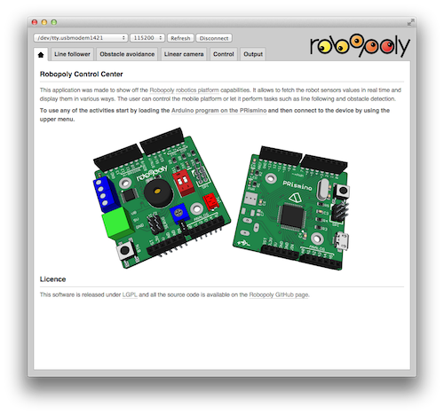
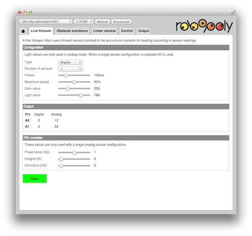
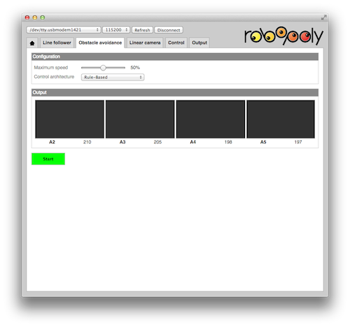
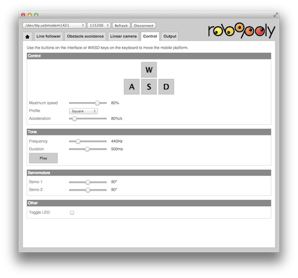
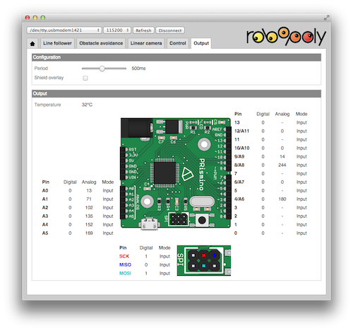

# Robopoly Control Center

This Chrome app displays information about a mobile platform based on the [EPFL robotics club](http://robopoly.epfl.ch) platoform: [kit PRisme](http://robopoly.epfl.ch/prisme). It allows to control the mobile platform and perform simple tasks such as line following, obstacle detection and light detection using a linear camera.

It is built as a [Google Chrome application](https://chrome.google.com/webstore/detail/robopoly-control-center/kimabfnmacaikklmibbbomomjffkfalo) which means [Chrome browser](https://www.google.com/chrome/) has to be installed first, the program language is JavaScript. This makes it compatible with all operating systems with no additional effort on the programming side. The communication is made using the [Serial API](http://developer.chrome.com/trunk/apps/app.hardware.html#serial) for Chrome.

## Presentation

Currently the application allows the user to make a line follower, do obstacle avoidance, view linear camera output and do light following, control the mobile platform and view pin values.

### Line Follower

IR sensors have to be mounted on the front of the robot and connected to the `A0` and `A1` pins (mind the potentiometer jumper on the shield). One can select a configuration with either one or two sensors, analog or digital and set the maximum speed. If one analog sensor configuration is selected one can also specify a PID controller coefficients.

### Obstacle avoidance

In obstacle avoidance the robot needs to have 4 IR sensors attached on the front on pins `A2` to `A5`. Two control architectures can be selected: rule-based (if..else) and a Braitenberg controller where the sensor values are directly applied to the motors via some constants.

### Linear camera

The linear camera tab allows to view the linear camera output, select how a peak is detected and do light following.

### Control

The control tab allows to move the mobile platform using WASD keys, select an acceleration profile (square or trapezoidal) and acceleration rate, control the buzzer, serbomotors position and LED state.

### Output

In the output tab all pins are configured as inputs and one can see what values are returned, it also shows the value of the internal temperature sensor of the micro controller.

## Program the PRismino

An Arduino sketch has to be uploaded first in order for the application to be able to communicate with the mobile base. It's located in `PRisminoArduino` folder.

## Install Chrome App

You can either [download the packed application from Chrome Web Store](https://chrome.google.com/webstore/detail/robopoly-control-center/kimabfnmacaikklmibbbomomjffkfalo) or download the source code from here and go to Chrome's Tools -> Extensions, check the "Developer mode" tickbox and click "Load unpacked extension...".

Downloading the source code makes it very easy to modifiy the application and add/fix features.

# Version log

## 0.4 (2014-12-04)

* Tuned some control constants for the rule-based obstace avoidance.

## 0.3 (2014-11-15)

* Added code for linear camera

* Fixed problems with Bluetooth communication

## 0.2 (2014-10-27)

* Made it easier to select between USB or Bluetooth communication in the PRismino sketch

## 0.1 (2014-09-04)

* Initial version

# Licence

This software is published under [LGPL](http://www.gnu.org/licenses/lgpl.html).
